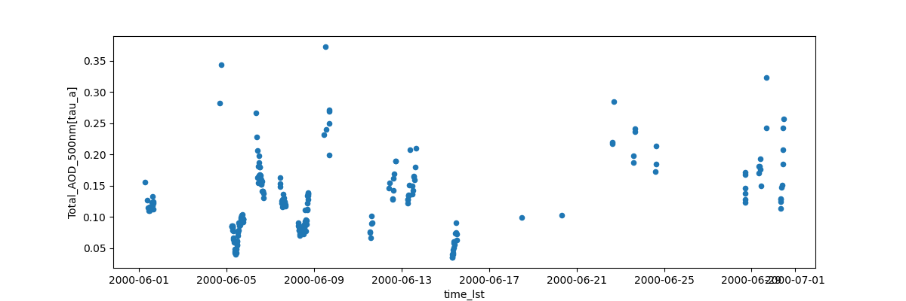

# pyaeronet

Python interface to AEROSOL ROBOTIC NETWORK (AERONET) web-service v3 API.

[AERONET](https://aeronet.gsfc.nasa.gov/) data provides information on the
aerosol optical depth at sites around the world. The v3 Web API makes
accessing the data easy, and this utility provides an interface for the API
to connect AERONET to [pandas](https://pandas.pydata.org/). This simplifies
comparison of AERONET to other datasets.

To Install:
    python -m pip install --user git+https://github.com/barronh/pyaeronet.git

Documentation:

https://barronh.github.io/pyaeronet

Example 1: time-series plot

    import pyaeronet

    api = pyaeronet.aeronet()
    df = api.to_dataframe(
        site='Cart_Site', SDA20=1, AVG=10,
        year=2000, month=6, day=1,
        year2=2000, month2=6, day2=30,
        add_lst=True
    )
    ax = df.plot.scatter(x='time_lst', y='Total_AOD_500nm[tau_a]')
    ax.figure.savefig('pyaeronet.png')

